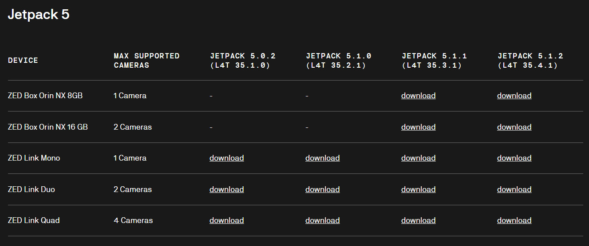

# Instalação da ZED2i e ZEDx na zed box (Jetson Orin NX)
## ZED2i
Antes de iniciar vamos instalar algumas dependências.
```shell
python -m pip install cython numpy opencv-python pyopengl
python3 -m pip install cython
python3 -m pip install numpy
```

Para instalação do setereolabs SDK  para dar suporte á camera vamos seguir este link da [Setereolabs](https://www-stereolabs-com.translate.goog/docs/get-started-with-zed-box-orin-nx/installation?_x_tr_sl=en&_x_tr_tl=pt-PT&_x_tr_hl=pt-PT&_x_tr_pto=wapp)

Portanto sabe qual a versão do jetpack
``` shell
$ apt-cache policy nvidia-jetpack
>  nvidia-jetpack:
>  Installed: 5.1.1-b56
>  Candidate: 5.1.1-b56
>  Version table:
>  *** 5.1.1-b56 500
>        500 https://repo.download.nvidia.com/jetson/common r35.3/main arm64 Packages
>        100 /var/lib/dpkg/status
```
Então na página dos [SDK Downloads](https://www.stereolabs.com/en-pt/developers/release) avançamos, fez-se download do [ZED SDK for JetPack 5.1.1 (L4T 35.3) 4.2 (Jetson Xavier, Orin AGX/NX/Nano, CUDA 11.4)](https://stereolabs.sfo2.cdn.digitaloceanspaces.com/zedsdk/4.2/ZED_SDK_Tegra_L4T35.3_v4.2.5.zstd.run), ou `wget https://stereolabs.sfo2.cdn.digitaloceanspaces.com/zedsdk/4.2/ZED_SDK_Tegra_L4T35.3_v4.2.5.zstd.run`

Depois damos permissão de execução e instalamos.
``` shell
sudo apt install zstd
chmox +x ZED_SDK_Tegra_L4T35.3_v4.2.5.zstd.run
./ZED_SDK_Tegra_L4T35.3_v4.2.5.zstd.run
```
Depois é necessário ir a `cd /usr/local/zed` e correr no ambiente python pretendido conda ou não `pip install pyzed-4.2-cp38-cp38-linux_aarch64.whl`. Para que ao fazer `import pyzed.sl as sl` não dê erro!

No fim pode testar a zed 2i com este programa [zed2i_orinNX.py](./zed2i_orinNX.py)

## ZEDx
Para esta instalação deve incialmente fazer os passos do ponto anterior

### Instalação de Drivers ZEDx

Nesta página [Zed Camera Drivers](https://www.stereolabs.com/en-pt/developers/drivers) podemos baixar os driver correspondentes com a versão de Jetpack, modelo de Jetson e Camera, nestas outras páginas [Get Started with ZED X](https://www.stereolabs.com/docs/get-started-with-zed-x#setting-up-your-system-for-zed-x) e [Install Zed Link Driver](https://www.stereolabs.com/docs/get-started-with-zed-link/install-the-drivers) podemos consultar alguma documentação.

Seguindo o link da página dos drivers encontramos para a nossa Jetson Orin NX o driver da Camera ZEDx para o Jetpack correspondente, conforme a imagem abaixo.

<div align="center">
  
</div>

No fez-se o download da versão para o Jetpack 5.1.1 para Jetson Orin NX 16Gb ou `wget https://stereolabs.sfo2.cdn.digitaloceanspaces.com/utils/drivers/ZEDX/1.2.2/R35.3/stereolabs-zedbox-onx16_1.2.2-LI-MAX96712-ALL-ZEDBOX-L4T35.3.1_arm64.deb`

Depois Instalamos: 
```shell
sudo dpkg -i stereolabs-zedbox-onx16_1.2.2-LI-MAX96712-ALL-ZEDBOX-L4T35.3.1_arm64.deb
```
